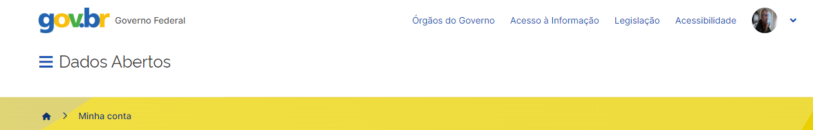

# Tableau
Dashboard com Tableau

O Tableau é uma plataforma de análise e visualização de dados líder no mercado que permite criar dashboards interativos e intuitivos para explorar e compartilhar informações valiosas. Com recursos avançados de visualização e uma interface amigável, é amplamente utilizado em diversas áreas, como negócios, finanças, saúde e educação, para tomadas de decisões e insights. Sua popularidade é impulsionada por suas vantagens em análise de dados, tornando-o uma escolha confiável para análise e visualização de dados.

Segue um exemplo de Dashboard criado com o [Tableau](https://public.tableau.com/app/profile/nilton.cardoso/viz/Dashboard-CrditosTributriosAtivosRFB/Painel_responsivo)

Dados fornecidos pelo [Portal de Dados Abertos](https://dados.gov.br/home)

O Portal Brasileiro de Dados Abertos é uma iniciativa do governo para disponibilizar informações públicas em formato aberto. O site oferece um catálogo com milhares de conjuntos de dados, incluindo informações sobre saúde, educação, meio ambiente, entre outros. O portal incentiva o uso das informações para fins educacionais, de pesquisa e de desenvolvimento de soluções inovadoras.
